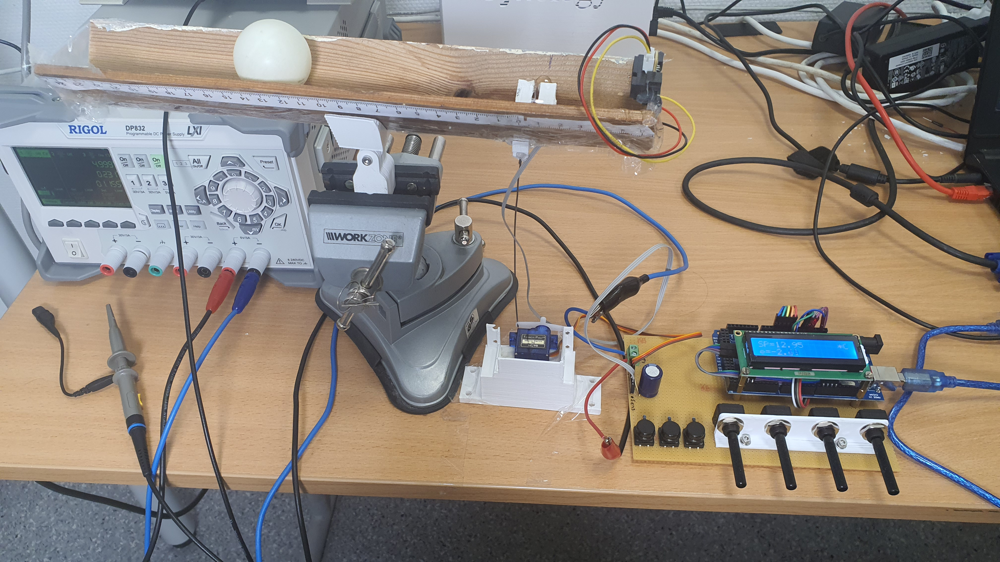

# PID_demo

Demonstration of a PID controller. Tested on Arduino Mega.

## Libraries

+ Button: https://github.com/madleech/Button

+ LiquidCrystal_I2C: https://github.com/johnrickman/LiquidCrystal_I2C

## Required parts

+ Arduino Mega

+ Sharp 2y0a21 Infrared Proximity Sensor

+ SG90 Servo Motor

+ 1602A LCD Display

+ Push buttons (3)

+ Potentiometers (4)

+ Parts from schematics

